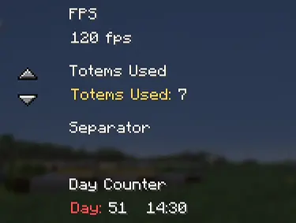
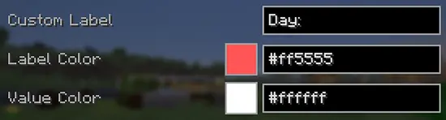

# 🌹 WindRose

WindRose adds a clean, fully customizable HUD with useful statistics all in Vanilla. This is a lightweight Client-side mod that improves your Minecraft Experience.

---

### Key Features

- Adds a new HUD with day counter, coordinates, direction, totem count and fps:

  

- Highly configurable:

  

- Separate color settings and custom labels:

  

- And a lot of other configs

---

### Notes

You are free to add this mod to any modpack you'd like.
